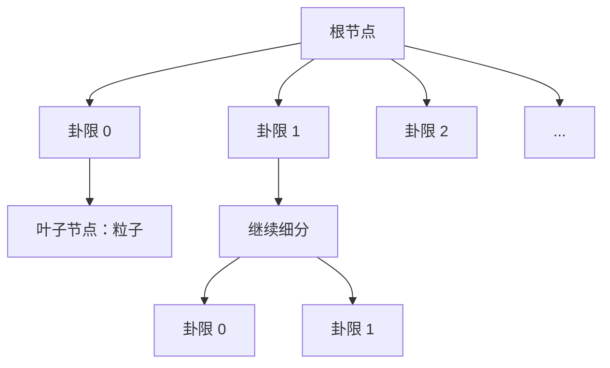

# 算法

三种力计算算法的详细说明。

## 直接 N²

最精确但计算代价最高的方法。

### 算法

对每个粒子，计算来自所有其他粒子的力：

$$\vec{F}_i = \sum_{j \neq i} \frac{G m_i m_j}{|\vec{r}_{ij}|^2 + \epsilon^2} \hat{r}_{ij}$$

### CUDA 实现

```cpp
__global__ void direct_force_kernel(
    const float* __restrict__ pos_x,
    const float* __restrict__ pos_y,
    const float* __restrict__ pos_z,
    const float* __restrict__ mass,
    float* __restrict__ force_x,
    float* __restrict__ force_y,
    float* __restrict__ force_z,
    int n, float softening
) {
    int i = blockIdx.x * blockDim.x + threadIdx.x;
    if (i >= n) return;

    float fx = 0, fy = 0, fz = 0;
    float xi = pos_x[i], yi = pos_y[i], zi = pos_z[i];

    for (int j = 0; j < n; ++j) {
        if (j == i) continue;

        float dx = pos_x[j] - xi;
        float dy = pos_y[j] - yi;
        float dz = pos_z[j] - zi;

        float r2 = dx*dx + dy*dy + dz*dz + softening*softening;
        float inv_r3 = rsqrtf(r2) / r2;

        float factor = mass[j] * inv_r3;
        fx += dx * factor;
        fy += dy * factor;
        fz += dz * factor;
    }

    force_x[i] = fx;
    force_y[i] = fy;
    force_z[i] = fz;
}
```

### 性能

| 粒子数 | 时间 (ms) | FPS |
|--------|----------|-----|
| 1千 | 0.1 | 10,000 |
| 1万 | 10 | 100 |
| 10万 | 1,000 | 1 |

::: warning
直接 N² 的复杂度为 O(N²)。不推荐用于 >1万 粒子。
:::

---

## Barnes-Hut

用于长程力的层次算法。

### 算法

1. 构建包含所有粒子的八叉树
2. 对每个粒子，遍历树
3. 如果节点足够远，使用其质心
4. 否则，递归进入子节点

### 多极近似

如果满足以下条件，节点可被近似：

$$\frac{s}{d} < \theta$$

其中：
- $s$ = 节点尺寸
- $d$ = 到粒子的距离
- $\theta$ = 开角（默认 0.5）

### 八叉树结构



### CUDA 实现

Barnes-Hut 算法有两个阶段：

1. **树构建**（CPU 或 GPU）
2. **力计算**（GPU）

```cpp
// 阶段 1：在 CPU 上构建八叉树
Octree tree;
tree.build(particles);

// 阶段 2：在 GPU 上计算力
__global__ void barnes_hut_force_kernel(
    const OctreeNode* nodes,
    const float* pos_x, ...
) {
    // 为每个粒子遍历树
    // 对远距离节点使用多极近似
}
```

### 性能

| 粒子数 | 时间 (ms) | FPS |
|--------|----------|-----|
| 1万 | 1 | 1,000 |
| 10万 | 10 | 100 |
| 100万 | 100 | 10 |

::: tip
Barnes-Hut 适合 10万+ 粒子的引力模拟。
:::

---

## 空间哈希

用于短程力的基于网格的算法。

### 算法

1. 将粒子位置哈希到网格单元
2. 对每个粒子，只检查相邻单元
3. 应用截断半径进行力计算

### 哈希函数

```cpp
__device__ int hash_position(float x, float y, float z, float cell_size, int grid_dim) {
    int ix = floorf(x / cell_size);
    int iy = floorf(y / cell_size);
    int iz = floorf(z / cell_size);
    return (ix * grid_dim * grid_dim + iy * grid_dim + iz) % (grid_dim * grid_dim * grid_dim);
}
```

### 邻居搜索


### CUDA 实现

```cpp
__global__ void spatial_hash_force_kernel(
    const float* pos_x, ...
    const int* cell_start,
    const int* cell_end,
    float cutoff_radius
) {
    int i = blockIdx.x * blockDim.x + threadIdx.x;

    // 获取单元索引
    int cx, cy, cz;
    get_cell_indices(pos_x[i], pos_y[i], pos_z[i], cx, cy, cz);

    float fx = 0, fy = 0, fz = 0;

    // 检查 27 个相邻单元
    for (int dx = -1; dx <= 1; ++dx) {
        for (int dy = -1; dy <= 1; ++dy) {
            for (int dz = -1; dz <= 1; ++dz) {
                int cell = hash_cell(cx + dx, cy + dy, cz + dz);

                // 遍历单元中的粒子
                for (int j = cell_start[cell]; j < cell_end[cell]; ++j) {
                    if (j == i) continue;

                    float r = distance(i, j);
                    if (r < cutoff_radius) {
                        // 添加力贡献
                    }
                }
            }
        }
    }
}
```

### 性能

| 粒子数 | 时间 (ms) | FPS |
|--------|----------|-----|
| 1万 | 0.5 | 2,000 |
| 10万 | 5 | 200 |
| 100万 | 50 | 20 |

::: tip
空间哈希适合力为短程的分子动力学和粒子流体模拟。
:::

---

## Velocity Verlet 积分

三种力计算方法都使用 Velocity Verlet 积分器：

$$\vec{x}(t + \Delta t) = \vec{x}(t) + \vec{v}(t) \Delta t + \frac{1}{2} \vec{a}(t) \Delta t^2$$

$$\vec{v}(t + \Delta t) = \vec{v}(t) + \frac{1}{2} [\vec{a}(t) + \vec{a}(t + \Delta t)] \Delta t$$

### 特性

- **辛积分**：长时间内守恒能量
- **时间可逆**：可以反向运行
- **二阶精度**：O(Δt²) 误差

### 能量守恒

```cpp
// 监控能量漂移
double E0 = system.getTotalEnergy();

for (int i = 0; i < 10000; ++i) {
    system.update(0.001);
}

double E1 = system.getTotalEnergy();
double drift = abs(E1 - E0) / abs(E0);
// 稳定系统通常 < 0.01%
```
