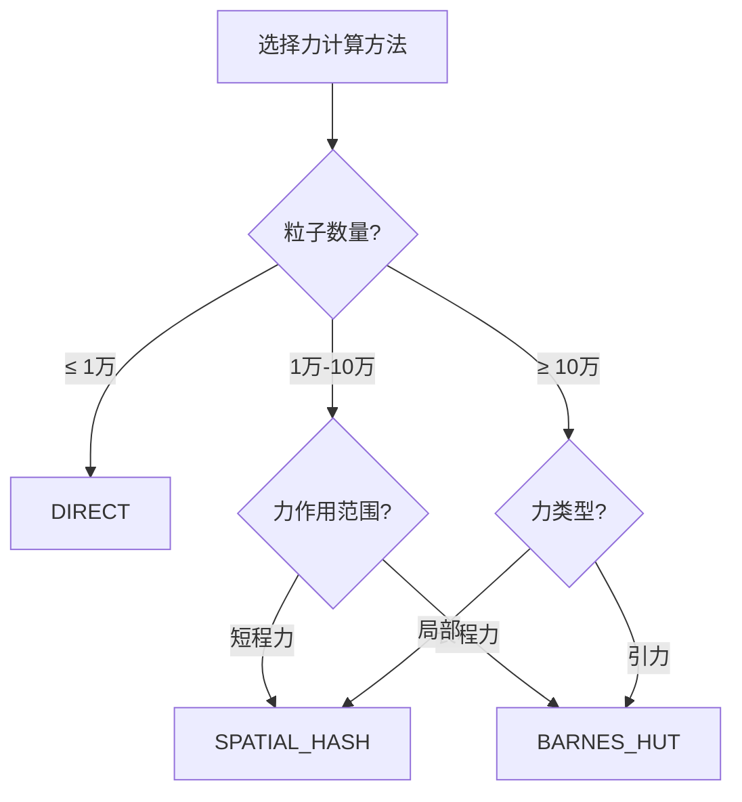

# 配置

模拟配置选项的完整参考。

## SimulationConfig

`SimulationConfig` 结构控制模拟的所有方面：

```cpp
struct SimulationConfig {
    // 粒子设置
    int particle_count = 10000;
    InitDistribution init_distribution = InitDistribution::SPHERICAL;

    // 力计算
    ForceMethod force_method = ForceMethod::BARNES_HUT;
    float softening = 0.01f;

    // 积分
    float dt = 0.001f;

    // 渲染
    bool enable_rendering = true;
    int window_width = 1280;
    int window_height = 720;

    // 诊断
    bool enable_profiling = false;
    bool enable_energy_monitor = false;
};
```

## 力计算方法

### ForceMethod 枚举

| 值 | 描述 | 复杂度 |
|---|------|--------|
| `ForceMethod::DIRECT` | 精确成对计算 | O(N²) |
| `ForceMethod::BARNES_HUT` | 层次八叉树 | O(N log N) |
| `ForceMethod::SPATIAL_HASH` | 基于网格的局部计算 | O(N) |

### 选择指南



## 初始分布

### InitDistribution 枚举

| 值 | 描述 | 用途 |
|---|------|------|
| `InitDistribution::SPHERICAL` | 均匀球体 | 星系团 |
| `InitDistribution::DISK` | 带旋转的薄盘 | 旋涡星系 |
| `InitDistribution::CUBE` | 均匀立方体 | 通用测试 |
| `InitDistribution::RANDOM` | 随机位置 | 压力测试 |

### 自定义分布

```cpp
// 手动创建粒子数据
ParticleData data;
data.resize(1000);

for (size_t i = 0; i < 1000; ++i) {
    // 设置位置、速度、质量
    data.position_x[i] = /* ... */;
    data.velocity_x[i] = /* ... */;
    data.mass[i] = 1.0f;
}

ParticleSystem system;
system.initialize(data, ForceMethod::BARNES_HUT);
```

## 软化参数

软化参数防止粒子非常接近时出现奇点：

$$F = \frac{G m_1 m_2}{(r^2 + \epsilon^2)^{3/2}}$$

| 值 | 效果 |
|---|------|
| 0.001 | 最小平滑，真实的近距离碰撞 |
| 0.01 | 默认值，精度与稳定性平衡 |
| 0.1 | 强平滑，稳定但精度较低 |
| 1.0 | 非常平滑，适合大尺度结构 |

## 时间步长

时间步长（`dt`）控制模拟精度和速度：

| 值 | 权衡 |
|---|------|
| 0.0001 | 高精度，进展缓慢 |
| 0.001 | 默认值，良好平衡 |
| 0.01 | 快速但可能发散 |
| 0.1 | 对大多数系统可能不稳定 |

::: tip
Velocity Verlet 积分器是辛积分器，意味着它在长时间内守恒能量。但是，过大的时间步长仍可能导致不稳定。监控总能量以验证稳定性。
:::

## 运行时控制

### 暂停/继续

```cpp
system.pause();
// ... 检查状态 ...
system.resume();
```

### 算法切换

运行时切换算法而无需重新初始化：

```cpp
system.setForceMethod(ForceMethod::SPATIAL_HASH);
```

### 状态检查点

```cpp
// 保存状态
system.saveState("checkpoint.nbody");

// 加载状态
system.loadState("checkpoint.nbody");
```

## HDF5 导出

```cpp
// 导出为 HDF5
system.exportHDF5("simulation_output.h5");

// HDF5 文件包含：
// - /particles/positions
// - /particles/velocities
// - /particles/masses
// - /metadata/config
// - /metadata/timestamp
```

使用 Python 读取：

```python
import h5py

with h5py.File('simulation_output.h5', 'r') as f:
    positions = f['/particles/positions'][:]
    velocities = f['/particles/velocities'][:]
    masses = f['/particles/masses'][:]
```
